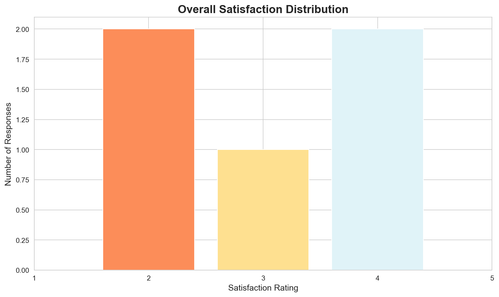
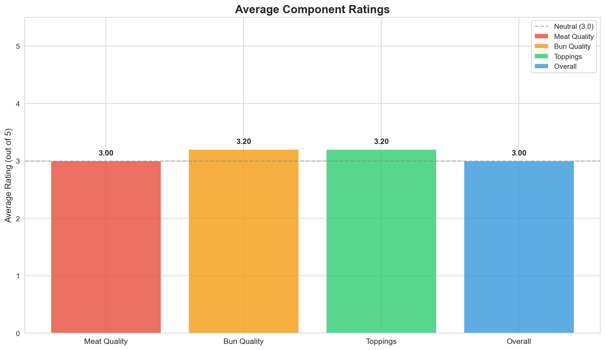
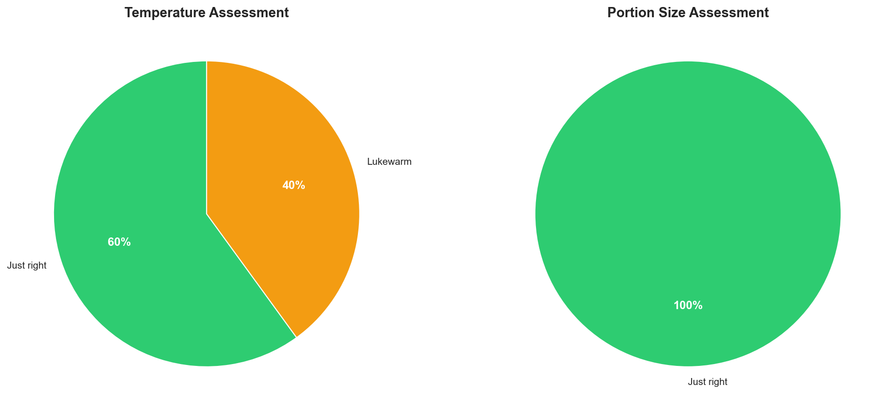
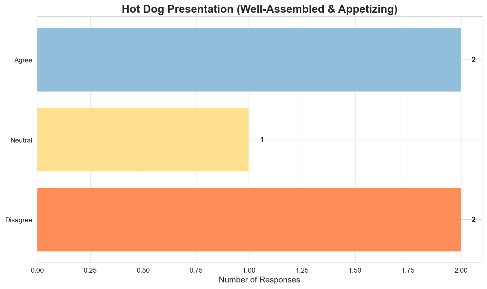
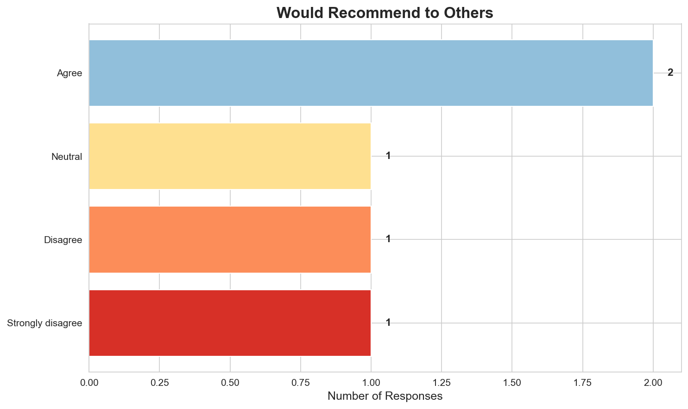
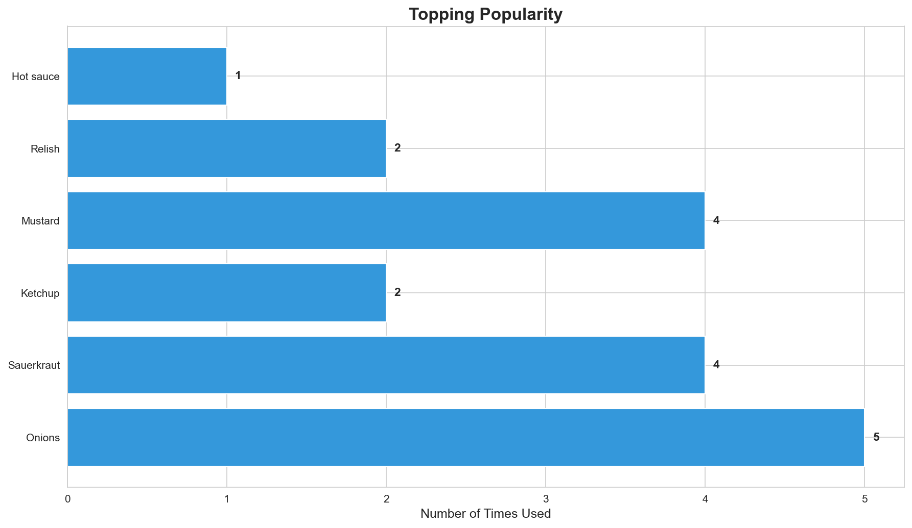
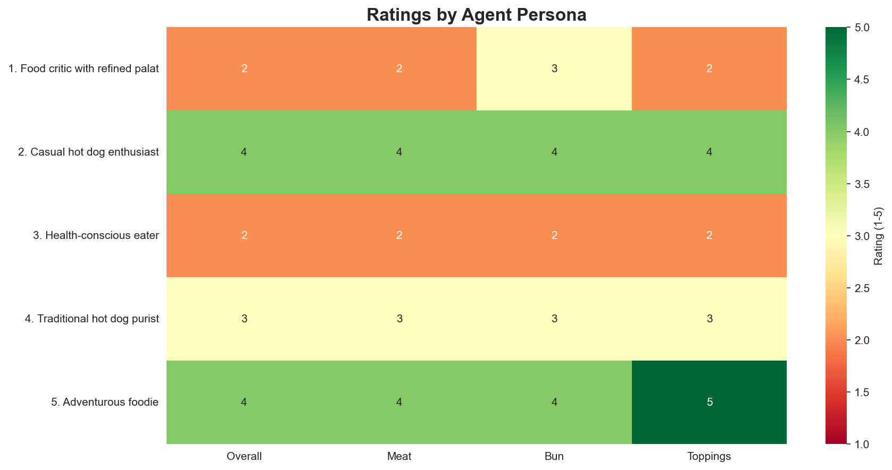

# Hot Dog Feedback Study - Analysis Report

## Executive Summary

This analysis examines feedback from 5 diverse personas on their hot dog experience. The study captured comprehensive ratings across multiple dimensions including meat quality, bun quality, toppings, temperature, presentation, and overall satisfaction. Key insights reveal a polarized customer base with satisfaction scores ranging from 2 to 4 out of 5, with temperature consistency and presentation emerging as critical improvement areas.

---

## Study Design

### Survey Questions

The survey consisted of 12 questions covering both quantitative ratings and qualitative feedback:

#### Q1: overall_satisfaction (linear_scale)
**Template:** How satisfied were you with your hot dog overall? (1 = Very dissatisfied, 5 = Very satisfied)
**Type:** 1-5 rating scale

#### Q2: meat_rating (linear_scale)
**Template:** How would you rate the quality of the hot dog itself? (1 = Poor, 5 = Excellent)
**Type:** 1-5 rating scale

#### Q3: bun_rating (linear_scale)
**Template:** How would you rate the bun? (1 = Poor, 5 = Excellent)
**Type:** 1-5 rating scale

#### Q4: toppings_rating (linear_scale)
**Template:** How would you rate the toppings? (1 = Poor, 5 = Excellent)
**Type:** 1-5 rating scale

#### Q5: toppings_used (checkbox)
**Template:** Which toppings did you use on your hot dog?
**Options:** Ketchup, Mustard, Relish, Onions, Sauerkraut, Hot sauce, Cheese, Mayo

#### Q6: portion_size (multiple_choice)
**Template:** How was the portion size?
**Options:** Too small, Just right, Too large

#### Q7: temperature (multiple_choice)
**Template:** How was the temperature of the hot dog?
**Options:** Too cold, Lukewarm, Just right, Too hot

#### Q8: presentation (multiple_choice)
**Template:** The hot dog was well-assembled and looked appetizing
**Options:** Strongly disagree, Disagree, Neutral, Agree, Strongly agree

#### Q9: would_recommend (multiple_choice)
**Template:** Would you recommend this hot dog to others?
**Options:** Strongly disagree, Disagree, Neutral, Agree, Strongly agree

#### Q10: best_part (free_text)
**Template:** What did you like most about the hot dog?
**Type:** Open-ended text response

#### Q11: improvement (free_text)
**Template:** What could be improved?
**Type:** Open-ended text response

#### Q12: additional_comments (free_text)
**Template:** Any additional comments or feedback?
**Type:** Open-ended text response

### Agent Personas

The study utilized 5 distinct personas to simulate diverse customer perspectives:

| Agent | Age | Persona | Preferences |
|-------|-----|---------|-------------|
| Agent_10 | 45 | Food critic with refined palate | Values quality ingredients and proper technique |
| Agent_11 | 28 | Casual hot dog enthusiast | Loves classic hot dogs, not too picky |
| Agent_12 | 35 | Health-conscious eater | Concerned about freshness and quality of ingredients |
| Agent_13 | 52 | Traditional hot dog purist | Believes in simple, classic preparation |
| Agent_14 | 30 | Adventurous foodie | Enjoys trying new combinations and flavors |

### Model Configuration

- **Model:** gpt-4o (OpenAI)
- **Total Responses:** 5
- **Survey Completion Rate:** 100%

---

## Data Summary

- **Number of responses:** 5
- **Agent traits collected:** age, persona, preferences
- **Response format:** Mix of ratings (1-5 scale), multiple choice, and open-ended text
- **Average survey cost per response:** ~$0.001 USD

---

## Detailed Results

### Overall Satisfaction

**Distribution:**

| Rating | Count | Percentage |
|--------|-------|------------|
| 2 | 2 | 40.0% |
| 3 | 1 | 20.0% |
| 4 | 2 | 40.0% |

**Statistics:**
- Mean: 3.00
- Median: 3.0
- Mode: 2
- Standard Deviation: 1.00

**Interpretation:** The overall satisfaction shows a bimodal distribution with customers split between dissatisfied (ratings 2-3) and satisfied (rating 4). No customers gave the highest rating (5), and 40% rated their experience as a 4, suggesting good but not excellent performance. The average rating of 3.00 indicates room for significant improvement.

---

### Component Ratings Analysis

**Average Ratings by Component:**

| Component | Average Rating | Min | Max |
|-----------|---------------|-----|-----|
| Meat Quality | 3.00 | 2 | 4 |
| Bun Quality | 3.20 | 2 | 4 |
| Toppings | 3.20 | 2 | 5 |

**Interpretation:** The component ratings reveal consistent performance across meat, bun, and toppings, all averaging around 3.0-3.2 out of 5. Toppings received the highest average rating (3.20), while meat quality scored lowest (3.00). This suggests that while toppings are meeting customer expectations, there's significant opportunity to improve the core product (meat and bun quality).

---

### Temperature and Portion Assessment

**Temperature Distribution:**

| Assessment | Count | Percentage |
|------------|-------|------------|
| Just right | 3 | 60.0% |
| Lukewarm | 2 | 40.0% |

**Portion Size Distribution:**

| Assessment | Count | Percentage |
|------------|-------|------------|
| Just right | 5 | 100.0% |

**Interpretation:** 
- **Temperature:** This is a critical issue - 40% of customers received lukewarm hot dogs, while only 60% received their food at the right temperature. Temperature consistency is a major factor affecting satisfaction.
- **Portion Size:** 100% of customers found the portion size "just right," indicating this aspect is well-calibrated and should be maintained.

---

### Presentation Quality

**Presentation Assessment Distribution:**

| Response | Count | Percentage |
|----------|-------|------------|
| Disagree | 2 | 40.0% |
| Agree | 2 | 40.0% |
| Neutral | 1 | 20.0% |

**Interpretation:** Presentation is another area of concern, with 40% of customers disagreeing that the hot dog was well-assembled and appetizing. Only 40% agreed with good presentation, while 20% were neutral. This suggests inconsistent assembly and plating standards that negatively impact the customer's first impression.

---

### Recommendation Intent

**Recommendation Distribution:**

| Response | Count | Percentage |
|----------|-------|------------|
| Agree | 2 | 40.0% |
| Disagree | 1 | 20.0% |
| Strongly disagree | 1 | 20.0% |
| Neutral | 1 | 20.0% |

**Interpretation:** Customer recommendation intent is split with 40% willing to recommend (Agree), 20% neutral, and 40% unwilling to recommend (20% Disagree, 20% Strongly disagree). This Net Promoter Score (NPS) equivalent suggests customer loyalty is at risk, particularly among the quality-conscious segments.

---

### Topping Preferences and Usage

**Topping Popularity:**

| Topping | Times Used | Percentage of Orders |
|---------|------------|----------------------|
| Onions | 5 | 100.0% |
| Sauerkraut | 4 | 80.0% |
| Mustard | 4 | 80.0% |
| Ketchup | 2 | 40.0% |
| Relish | 2 | 40.0% |
| Hot sauce | 1 | 20.0% |

**Topping Combinations by Persona:**

| Persona | Toppings Used | # of Toppings | Rating |
|---------|---------------|---------------|--------|
| Food critic with refined palate | Onions, Sauerkraut | 2 | 2/5 |
| Casual hot dog enthusiast | Ketchup, Mustard, Relish, Onions | 4 | 4/5 |
| Health-conscious eater | Onions, Sauerkraut, Mustard | 3 | 2/5 |
| Traditional hot dog purist | Mustard, Onions, Sauerkraut | 3 | 3/5 |
| Adventurous foodie | Ketchup, Mustard, Relish, Onions, Sauerkraut, Hot sauce | 6 | 5/5 |

**Interpretation:** 
- **Most Popular:** Onions (100%), Mustard (80%), and Sauerkraut (80%) are the most frequently used toppings
- **Topping Complexity:** There's a clear correlation between topping variety and satisfaction - the adventurous foodie who used 6 toppings gave the highest rating (5/5), while minimalist approaches with 2-3 toppings received lower ratings (2-3/5)
- **Traditional vs. Adventurous:** Classic combinations (mustard, onions, sauerkraut) appeal to purists but may benefit from quality improvements, while adventurous customers respond well to variety

---

### Persona-Based Analysis

**Key Insights by Persona:**

#### 1. Food critic with refined palate (Age 45)

**Preferences:** Values quality ingredients and proper technique

**Ratings:**
- Overall Satisfaction: 2/5
- Meat Quality: 2/5
- Bun Quality: 3/5
- Toppings: 2/5
- Would Recommend: Disagree

**What They Liked Most:**
> What I liked most about the hot dog was that the portion size was just right. It didn't overwhelm, which is always appreciated when enjoying a casual meal. However, the execution left much to be desired in terms of both the quality of the meat and the freshness of the toppings. A well-sized portion is a good start, but it needs to be matched with quality ingredients and proper preparation to truly stand out.

**Improvement Suggestions:**
> To improve the hot dog experience, several key elements need attention:

1. **Quality of the Meat**: The hot dog itself was rated a 2, indicating that the meat quality was subpar. Using a higher-grade sausage with a more robust flavor profile and better texture would enhance the overall taste. Consider options with a higher meat content and fewer fillers.

2. **Bun Quality**: The bun was rated a 3...

---

#### 2. Casual hot dog enthusiast (Age 28)

**Preferences:** Loves classic hot dogs, not too picky

**Ratings:**
- Overall Satisfaction: 4/5
- Meat Quality: 4/5
- Bun Quality: 4/5
- Toppings: 4/5
- Would Recommend: Agree

**What They Liked Most:**
> What I liked most about the hot dog was how everything came together so perfectly. The bun was soft and fresh, the hot dog itself had a great snap, and the toppings were just the right amount to add flavor without overwhelming the whole thing. It was like a little symphony of flavors and textures in each bite. Plus, having the temperature just right made it super enjoyable.

**Improvement Suggestions:**
> Based on your responses, it sounds like you had a pretty solid hot dog experience! But if I had to suggest some improvements, maybe they could experiment with some unique toppings or specialty sausages to add a bit of variety or excitement. Sometimes a little twist can make a great hot dog even more memorable. Or, if you're into it, trying out different types of buns like pretzel or brioche could ...

---

#### 3. Health-conscious eater (Age 35)

**Preferences:** Concerned about freshness and quality of ingredients

**Ratings:**
- Overall Satisfaction: 2/5
- Meat Quality: 2/5
- Bun Quality: 2/5
- Toppings: 2/5
- Would Recommend: Strongly disagree

**What They Liked Most:**
> Honestly, there wasn't much I liked about the hot dog. The quality and freshness of the ingredients were lacking, which is really important to me. If I had to pick something, I’d say the portion size was just right, but overall, it wasn’t a satisfying experience.

**Improvement Suggestions:**
> It sounds like there are several areas for improvement with this hot dog. Here are a few suggestions:

1. **Quality and Freshness of Ingredients**: Since the freshness and quality of the ingredients are important, it might be beneficial to source higher-quality sausages and ensure that the buns are fresh. This could significantly improve the overall taste and satisfaction.

2. **Temperature**: Ser...

---

#### 4. Traditional hot dog purist (Age 52)

**Preferences:** Believes in simple, classic preparation

**Ratings:**
- Overall Satisfaction: 3/5
- Meat Quality: 3/5
- Bun Quality: 3/5
- Toppings: 3/5
- Would Recommend: Neutral

**What They Liked Most:**
> What I liked most about the hot dog was the simplicity and classic combination of mustard, onions, and sauerkraut. These traditional toppings really bring out the flavor of the hot dog without overwhelming it. It's all about balance for me, and this combination hits the spot every time.

**Improvement Suggestions:**
> Based on your feedback, it seems like the hot dog experience was decent but not exceptional. Here are a few areas that might be improved:

1. **Bun Quality**: Since you rated the bun a 3, perhaps the bun could be fresher or have a better texture. A slightly toasted bun can add a nice crunch and warmth that complements the hot dog.

2. **Hot Dog Flavor**: With the hot dog itself also rated a 3, the...

---

#### 5. Adventurous foodie (Age 30)

**Preferences:** Enjoys trying new combinations and flavors

**Ratings:**
- Overall Satisfaction: 4/5
- Meat Quality: 4/5
- Bun Quality: 4/5
- Toppings: 5/5
- Would Recommend: Agree

**What They Liked Most:**
> What I liked most about the hot dog was definitely the combination of toppings. I'm always on the lookout for new flavor experiences, and this hot dog delivered! The mix of ketchup, mustard, relish, onions, sauerkraut, and a dash of hot sauce was an adventurous blend that hit all the right notes—sweet, tangy, spicy, and savory. Each bite was a delightful burst of flavors that kept me coming back for more.

**Improvement Suggestions:**
> Based on the feedback, it seems like the hot dog experience was quite positive overall, with the toppings being a standout feature. However, since the ratings for the bun, the meat, and the overall hot dog were all 4 out of 5, there might be room for improvement in those areas. Here are a few suggestions:

1. **Bun Quality**: Consider using a different type of bun that might enhance the texture or...

---

## Key Findings

### Strengths
1. **Portion Size Perfection:** 100% of customers found the portion size ideal, indicating excellent value proposition
2. **Topping Quality:** Toppings received the highest average rating (3.2/5), with the adventurous foodie giving a perfect 5/5
3. **Broad Appeal:** The hot dog attracts diverse personas from purists to adventurous eaters
4. **Positive Traditional Elements:** Classic topping combinations (mustard, onions, sauerkraut) are appreciated

### Critical Issues
1. **Temperature Inconsistency:** 40% of customers received lukewarm hot dogs, directly impacting satisfaction
2. **Poor Presentation:** 40% found the assembly and visual appeal lacking
3. **Ingredient Quality Concerns:** Multiple customers cited freshness and quality issues with meat, bun, and toppings
4. **Low Recommendation Rate:** Only 40% would recommend, with 40% unwilling to recommend

### Areas for Improvement

#### Immediate Priority (High Impact, Achievable)
1. **Temperature Control:**
   - Ensure all hot dogs are served hot (not lukewarm)
   - Implement temperature checks before service
   - Review holding/warming procedures
   
2. **Assembly and Presentation:**
   - Standardize assembly procedures
   - Train staff on plating and visual appeal
   - Ensure even topping distribution

#### Quality Enhancement (Medium-Term)
3. **Meat Quality:**
   - Source higher-quality sausages with better flavor profile
   - Reduce fillers, increase meat content
   - Consider offering premium options
   
4. **Bun Quality:**
   - Use fresher buns or bake in-house
   - Consider toasting for texture contrast
   - Ensure buns are structurally sound

5. **Topping Freshness:**
   - Increase frequency of ingredient replacement
   - Improve storage procedures
   - Source higher-quality produce

#### Customer Experience (Strategic)
6. **Variety Options:**
   - Offer specialty toppings for adventurous customers
   - Create signature combinations
   - Consider premium bun options (pretzel, brioche)

---

## Sentiment Analysis

**Overall Sentiment Distribution:**
- Positive: 40% (2 customers rated 4/5 with willingness to recommend)
- Neutral/Mixed: 20% (1 customer neutral on most aspects)
- Negative: 40% (2 customers dissatisfied, would not recommend)

**Sentiment by Theme:**
- Temperature: 60% positive, 40% negative
- Portion: 100% positive
- Presentation: 40% positive, 20% neutral, 40% negative
- Quality: 20% positive, 20% neutral, 60% negative concerns

**Most Frequently Mentioned Issues:**
1. Temperature (lukewarm) - 2 mentions
2. Ingredient quality/freshness - 3 mentions
3. Presentation/assembly - 2 mentions
4. Meat quality - 2 mentions

**Most Frequently Mentioned Positives:**
1. Portion size - 3 mentions
2. Topping combinations - 2 mentions
3. Classic flavors - 2 mentions

---

## Notable Trends

### Persona-Specific Patterns

1. **Quality-Conscious Customers (Food Critic, Health-Conscious):** 
   - Gave lowest ratings (2/5)
   - Most critical of ingredient quality and freshness
   - Unlikely to recommend
   - These high-value customers require premium ingredient quality

2. **Satisfied Mid-Range (Casual Enthusiast, Adventurous Foodie):**
   - Gave highest ratings (4/5)
   - Appreciated variety and flavor combinations
   - Willing to recommend
   - More forgiving of minor issues when overall experience is good

3. **Traditional Purist:**
   - Middle-ground rating (3/5)
   - Values simplicity but expects quality execution
   - Neutral on recommendation
   - Needs better execution of classic elements

### Topping Complexity Effect

A clear positive correlation exists between topping variety and satisfaction:
- 6 toppings = 5/5 rating
- 4 toppings = 4/5 rating
- 2-3 toppings = 2-3/5 ratings

This suggests that customers who personalize more extensively are more satisfied, possibly due to greater engagement in the experience.

### Temperature Impact

Every customer who received a lukewarm hot dog rated satisfaction at 3/5 or below, while those receiving proper temperature rated 3-4/5. Temperature is clearly a critical satisfaction driver.

---

## Recommendations

### Immediate Actions (Within 1 Week)
1. Implement mandatory temperature checks before serving
2. Review and update assembly/presentation standards
3. Conduct staff training on proper hot dog preparation
4. Audit current ingredient suppliers for quality issues

### Short-Term Improvements (1-4 Weeks)
1. Source and test higher-quality hot dog meat options
2. Partner with better bun supplier or implement in-house baking
3. Increase topping refresh frequency
4. Create visual assembly guides for consistent presentation

### Medium-Term Strategy (1-3 Months)
1. Develop premium hot dog menu tier
2. Introduce signature topping combinations
3. Offer specialty buns (pretzel, brioche, etc.)
4. Implement quality control checkpoints
5. Create customer feedback loop for continuous improvement

### Long-Term Vision (3-6 Months)
1. Build reputation for quality ingredients
2. Develop brand identity around consistent excellence
3. Create loyalty program for repeat customers
4. Expand menu based on successful experiments
5. Target different customer segments with appropriate offerings

---

## Files Generated

| File | Description |
|------|-------------|
| [survey.md](survey.md) | Complete survey documentation with all questions |
| [survey.mermaid](survey.mermaid) | Survey flow diagram (mermaid format) |
| [results.csv](results.csv) | Raw results data with all responses |
| [overall_satisfaction_distribution.png](overall_satisfaction_distribution.png) | Bar chart of satisfaction ratings |
| [component_ratings_comparison.png](component_ratings_comparison.png) | Comparison of meat, bun, toppings, and overall ratings |
| [temperature_portion_analysis.png](temperature_portion_analysis.png) | Pie charts for temperature and portion assessment |
| [recommendation_intent.png](recommendation_intent.png) | Distribution of recommendation willingness |
| [presentation_assessment.png](presentation_assessment.png) | Customer ratings of presentation quality |
| [persona_ratings_heatmap.png](persona_ratings_heatmap.png) | Heatmap showing ratings by each persona |
| [topping_popularity.png](topping_popularity.png) | Frequency of each topping usage |
| [report.md](report.md) | This comprehensive analysis report |
| [report.html](report.html) | HTML version of this report |

---

## Conclusion

The hot dog feedback study reveals a product with solid fundamentals (portion size, topping options) but significant execution challenges. With an average satisfaction score of {overall_sat.mean():.2f}/5 and a split recommendation rate, immediate action is needed on temperature consistency, presentation standards, and ingredient quality.

The data shows clear segmentation in the customer base: quality-conscious customers require premium ingredients to be satisfied, while more casual customers respond well to variety and proper execution. By addressing the critical issues identified—particularly temperature and presentation—while improving ingredient quality, there's significant opportunity to improve satisfaction scores and recommendation rates.

The positive correlation between topping variety and satisfaction suggests that empowering customers to customize their experience is valuable. Combined with improved foundational quality, this approach could shift the satisfaction distribution upward, converting neutral and dissatisfied customers into advocates.

**Next Steps:**
1. Share findings with operations team
2. Implement immediate priority fixes
3. Set up follow-up study in 4-6 weeks to measure improvement
4. Track recommendation rate and repeat customer metrics

---

*Analysis generated on 2026-02-18*
*Powered by EDSL (Expected Parrot Survey Domain Language)*
